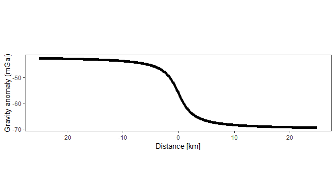
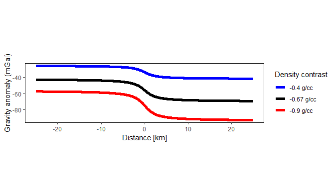
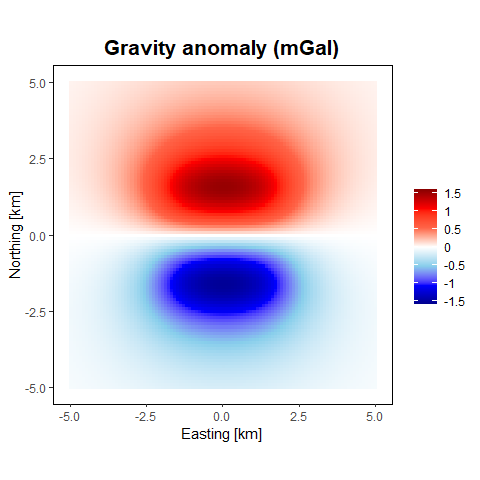
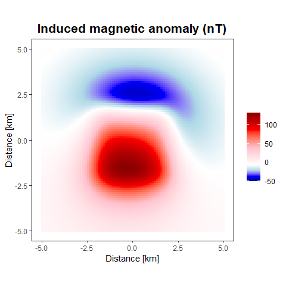

# gravmagsubs

**Gravitational and magnetic attraction of 3-D vertical rectangular
prisms**

**gravmagsubs** is a software package for the *R* language (R Core Team
2021) for forward modeling of gravity and magnetic anomalies from
collections of 3-D right rectangular prisms. The package implements
computational approaches developed by (Plouff 1975a, 1975b, 1976) for
forward modeling of gravity and magnetic anomalies.

This package is dependent on the following *R* packages:

`Rcpp` - Seamless R and C++ Integration (Eddelbuettel and Francois 2011)

# How to cite gravmagsubs

``` r
citation("gravmagsubs")
```

    ## 
    ## To cite gravmagsubs in publications, please use:
    ## 
    ##   Cronkite-Ratcliff, C., Phelps, G., Scheirer, D., 2022, gravmagsubs:
    ##   Gravitational and magnetic attraction of 3-D vertical rectangular
    ##   prisms, U.S. Geological Survey software release, R package, version
    ##   1.0, https://doi.org/10.5066/P9HBSPRM
    ## 
    ## A BibTeX entry for LaTeX users is
    ## 
    ##   @Manual{,
    ##     author = {Collin Cronkite-Ratcliff and Geoffrey Phelps and Daniel Scheirer},
    ##     title = {gravmagsubs: Gravitational and magnetic attraction of 3-D vertical rectangular prisms},
    ##     publisher = {U.S. Geological Survey},
    ##     address = {Reston, VA},
    ##     version = {1.0},
    ##     note = {R package},
    ##     institution = {U.S. Geological Survey},
    ##     year = {2022},
    ##     doi = {10.5066/P9HBSPRM},
    ##     url = {https://doi.org/10.5066/P9HBSPRM},
    ##   }

# Installation

## Prerequisites

It is assumed that users already have installed R
(<https://www.r-project.org>) (R Core Team 2021).

Pandoc (<https://pandoc.org>) is required to create the package
vignettes. Pandoc can be obtained by installing the Rstudio IDE
(<https://posit.co/>), which comes with Pandoc. If you do not install
the Rstudio IDE, you will need to install Pandoc individually
(<https://pandoc.org/installing.html>).

## Installation

Use the `remotes` package (Csárdi et al. 2022) to install the package
directly from code.usgs.gov. When running `remotes::install_gitlab`, you
may be asked:

``` r
# If you've never installed the "remotes" package:
install.packages("remotes")

#Installing the package from gitlab
remotes::install_gitlab("gmegsc/gravmagsubs",
                        host = "code.usgs.gov",
                        build_opts = c("--no-resave-data",
                                       "--no-manual"),
                        dependencies = TRUE,
                        build_vignettes = TRUE)

These packages have more recent versions available.
It is recommended to update all of them.
Which would you like to update?

1: All                                 
2: CRAN packages only                  
3: None                                

Enter one or more numbers, or an empty line to skip updates: 3
```

Choose “3. None” by typing the number 3, and update all packages after
the installation.

Regularly, it is a good idea to update ALL your packages in R. If using
RStudio, this is quite easy, there’s an Update button in the “Packages”
tab. This checks CRAN for updates. It is a good idea to click this
update regularly.


## Using the package

After installation, in order to use the package, load the package into
the R session:

``` r
library(gravmagsubs)
```

## Further Details

For help on how to use the package, use the following command to view
the documentation for the package:

``` r
?gravmagsubs
```

or

``` r
help(gravmagsubs)
```

To view the documentation for the functions `rectprismgrav()` or
`rectprismmag()`:

``` r
?rectprismgrav
?rectprismmag
```

or

``` r
help(rectprismgrav)
help(rectprismmag)
```

# Example of use

The `gravmagsubs` package provides tools for computing the gravitational
and magnetic anomalies generated by 3-D vertical rectangular prisms at
specific observation points. The package consists of two functions:

- `rectprismgrav()` : Computes the gravitational attraction of 3-D right
  rectangular prisms.

- `rectprismmag()` : Computes the magnetic effect of 3-D right
  rectangular prisms.

Each function can compute the total anomaly of a series of *N* prisms at
*M* observation points, returned as a matrix of *M* rows and 1 column.

Each function also has a logical flag `bycell` (default `FALSE`). If
`bycell=TRUE`, the function returns the contribution from each
individual prism. In this case, the function will return a matrix of *M*
rows by *N* columns.

### rectprismgrav()

The `rectprismgrav()` function calculates the gravity anomaly from a
series of 3-D rectangular prisms with vertical sides using the algorithm
of Plouff (1975a).

To calculate the gravity anomaly of a single prism at a single point:

``` r
#########################################################
## gravity anomaly of a single prism at a single point ##

# location of the point where the gravity anomaly will be calculated
gravstation <- data.frame(x=0, y=0, z=0)

# the rectangular prism is defined by its six edges (distance in km)
prism1 <- data.frame(xmin=-5, xmax=5,
                     ymin=-5, ymax=5,
                     zmin=-10, zmax=-5)

# density contrast in g/cc
drho <- 0.3

gravanom <- rectprismgrav(gravstation$x, gravstation$y, gravstation$z,
                          prism1$xmin, prism1$xmax,
                          prism1$ymin, prism1$ymax,
                          prism1$zmin, prism1$zmax, drho)

# gravity anomaly (mGal)
print(gravanom)
```

    ##          [,1]
    ## [1,] 13.17689

To calculate the gravity anomaly at multiple stations along a 2-D
cross-section:

``` r
#########################################################
## gravity anomaly from a 2-D section                  ##

# gravity station x-axis locations
grav.calc <- data.frame(X = seq(-25, by=.1, length=500))

# density contrast in g/cc
rho <- -0.67

# 2-D section consists of a layered model with density
# contrast extending to 1 km on the left side and 1.5 km
# on the right side
h1 <- 1.5
h2 <- 1

# create the 2-D section, with prisms measuring 1 km
# horizontally and 100 m vertically.
prism.width.h <- 1
prism.width.v <- 0.1
X1 <- seq(-499.5, 499.5, by=prism.width.h)
Z1 <- seq(-3.95, -0.05, by=prism.width.v)
XZr <- expand.grid(xcenter=X1, Y=0, zcenter=Z1)

# define the density contrast as 0 or -0.67 g/cc.
XZr$density <- 0
XZr$density[XZr$zcenter > -h1] <- rho
XZr$density[XZr$zcenter > -(h1+h2) & XZr$xcenter > 0] <- rho

# the y- and z-locations are both zero
grav.calc$Y <- 0
grav.calc$Z <- 0

# Calculate the gravity anomaly.
# Extend the prisms +/-500 km in the Y direction
# to approximate a perfect 2-D model.
grav.calc$Ggms <- rectprismgrav(grav.calc$X, grav.calc$Y, grav.calc$Z,
                                XZr$xcenter - prism.width.h/2,
                                XZr$xcenter + prism.width.h/2,
                                XZr$Y - 500, XZr$Y + 500,
                                XZr$zcenter - prism.width.v/2,
                                XZr$zcenter + prism.width.v/2, XZr$density)

library(ggplot2)

ggplot() +
  geom_line(data = grav.calc, linewidth=2, aes(x = X, y = Ggms)) +
  labs(title = "", x = "Distance [km]", y = "Gravity anomaly (mGal)") +
  theme(panel.background=element_rect(colour="black", fill="white"),
        panel.grid = element_blank(),
        plot.title = element_text(face = "bold",hjust = 0.5, size=16 ),
        aspect.ratio = 1/4)
```



Use the `bycell=TRUE` option and unit density (1 g/cc) to obtain the
sensitivity matrix.

``` r
# Use unit density contrast to obtain sensitivity matrix
XZr$density1 <- 1
XZr.sensmat <- rectprismgrav(grav.calc$X, grav.calc$Y, grav.calc$Z,
                             XZr$xcenter - prism.width.h/2,
                             XZr$xcenter + prism.width.h/2,
                             XZr$Y - 500, XZr$Y + 500,
                             XZr$zcenter - prism.width.v/2,
                             XZr$zcenter + prism.width.v/2, XZr$density1,
                             bycell=TRUE)
```

Now define two new cross-sections with different density values. The
gravity anomaly of these new cross-sections can be obtained by
multiplying the new density values with the sensitivity matrix, rather
than re-running `rectprismgrav()`.

``` r
# Define different density contrast values.
XZr$density2 <- 0
XZr$density2[XZr$density == rho] <- -0.9
XZr$density3 <- 0
XZr$density3[XZr$density == rho] <- -0.4

# Use matrix multiplication to obtain new gravity anomaly.
gravanom.models <- XZr.sensmat %*% as.matrix(XZr[,c("density", "density2", "density3")])

grav.calc$gmod.orig <- gravanom.models[,1]
grav.calc$gmod.low <- gravanom.models[,2]
grav.calc$gmod.high <- gravanom.models[,3]

ggplot() +
  geom_line(data = grav.calc, linewidth=2,
            aes(x = X, y = gmod.low, colour = "-0.9 g/cc")) +
  geom_line(data = grav.calc, linewidth=2,
            aes(x = X, y = gmod.orig, colour = "-0.67 g/cc")) +
  geom_line(data = grav.calc, linewidth=2,
            aes(x = X, y = gmod.high, colour = "-0.4 g/cc")) +
  scale_colour_manual(name="Density contrast", values=c("blue", "black", "red")) +
  labs(title = "", x = "Distance [km]", y = "Gravity anomaly (mGal)") +
  theme(panel.background=element_rect(colour="black", fill="white"),
        legend.key = element_rect(fill = "white"),
        legend.position = "right",
        panel.grid = element_blank(),
        plot.title = element_text(face = "bold", hjust = 0.5, size=16 ),
        aspect.ratio = 1/4)
```



To calculate the gravity anomaly at a 2-D grid of stations located above
a 3-D grid of prisms with different density values:

``` r
#########################################################
## gravity anomaly from 3-D gridded source model       ##

# first, create an array of stations
xstations <- seq(-5, 5, by=0.1)
ystations <- seq(-5, 5, by=0.1)
D3.stations <- expand.grid(xstations, ystations)
D3.stations$Zstation <- 0
names(D3.stations) <- c("Xstation", "Ystation", "Zstation")

# second, create an array of prisms
width <- 0.1
half.width <- width / 2

xsource <- seq(-2 + half.width, 2 - half.width, by=width)
ysource <- seq(-2 + half.width, 2 - half.width, by=width)
zsource <- seq(-3 + half.width, -1 - half.width, by=width)

D3.source <- expand.grid(xsource, ysource, zsource)
names(D3.source) <- c("xcenter", "ycenter", "zcenter")

# density varies along the y-axis
D3.source$density <- 0.1 * D3.source$ycenter

half.width <- width / 2

D3.gravanom <- rectprismgrav(D3.stations$Xstation,
                             D3.stations$Ystation,
                             D3.stations$Zstation,
                             D3.source$xcenter - half.width,
                             D3.source$xcenter + half.width,
                             D3.source$ycenter - half.width,
                             D3.source$ycenter + half.width,
                             D3.source$zcenter - half.width,
                             D3.source$zcenter + half.width,
                             D3.source$density,
                             bycell=FALSE)

library(scales)

# create data frame
d3.st <- data.frame(x=D3.stations$Xstation, y=D3.stations$Ystation,
                    val1 = D3.gravanom)

# plot with custom color scale 
ggplot() +
  geom_raster(data = d3.st, aes(x = x, y = y, fill = val1)) +
  scale_fill_gradientn(
    colours = c("darkblue", "blue", "skyblue", "white", "tomato", "red", "darkred"),
    values = rescale(c(-1.5, 0, 1.5)),
    breaks = seq(-1.5, 1.5, 0.5),
    labels = paste(seq(-1.5, 1.5, 0.5)),
    limits = c(-1.6, 1.6),
    name = "") +
  labs(x = "Easting [km]", 
       y = "Northing [km]",
       title = "Gravity anomaly (mGal)") +
  theme(panel.background = element_rect(colour = "black", fill = "white"),
        panel.grid = element_blank(),
        plot.title = element_text(face = "bold", hjust = 0.5, size=16),
        aspect.ratio = 1)
```



### rectprismmag()

The `rectprismmag()` function calculates the magnetic field anomaly from
a series of 3-D rectangular prisms with vertical sides using the
algorithm of Plouff (1975b).

To calculate the magnetic anomaly of a single prism at a single point:

``` r
#########################################################
## magnetic anomaly of single prism at a single point  ##

# location of the point where the magnetic anomaly will be calculated
magstation <- data.frame(x=-0.3, y=-1.5, z=0)

# the rectangular prism is defined by its six edges (distance in km)
prism1 <- data.frame(xmin=-2, xmax=2,
                     ymin=-2, ymax=2,
                     zmin=-3, zmax=-1)

susc <- 0.015   # susceptiblity (SI)
mstr <- 0       # remanent magnetization (A/m)
mincl <- 0      # remanent inclination (deg)
mdecl <- 0      # remanent declination (deg)
ftotal <- 48800 # Earth's field intensity (nT)
fincl <- 60     # field inclination (deg)
fdecl <- 12     # field declination (deg)

maganom <- rectprismmag(magstation$x, magstation$y, magstation$z,
                        prism1$xmin, prism1$xmax,
                        prism1$ymin, prism1$ymax,
                        prism1$zmin, prism1$zmax, susc,
                        mstr, mincl, mdecl,
                        ftotal, fincl, fdecl)

# magnetic anomaly (nT)
print(maganom)
```

    ##         [,1]
    ## [1,] 131.161

Calculate the magnetic anomaly at a 2-D grid of stations located above a
3-D grid of prisms. In this example, susceptibility values are generated
randomly from a normal distribution with a mean of 0.015 SI units and a
standard deviation of 0.001 SI units. No remanent magnetization is
present in this example, so the magnetic anomaly is generated entirely
from induced magnetization.

``` r
#########################################################
## magnetic anomaly from 3-D gridded source model      ##

# first, create an array of stations
xstations <- seq(-5, 5, by=0.1)
ystations <- seq(-5, 5, by=0.1)
D3.stations <- expand.grid(xstations, ystations)
D3.stations$Zstation <- 0
names(D3.stations) <- c("Xstation", "Ystation", "Zstation")

# second, create an array of prisms
width <- 0.1
half.width <- width / 2

xsource <- seq(-2 + half.width, 2 - half.width, by=width)
ysource <- seq(-2 + half.width, 2 - half.width, by=width)
zsource <- seq(-3 + half.width, -1 - half.width, by=width)

D3.source <- expand.grid(xsource, ysource, zsource)
names(D3.source) <- c("xcenter", "ycenter", "zcenter")

# normally distributed, spatially uncorrelated, magnetic susceptibility
set.seed(1)
D3.source$suscnorm <- rnorm(n=length(D3.source[,1]), mean=0.015, sd=0.001)

D3.source$nrmstr <- 0
D3.source$nrmdecl <- 0
D3.source$nrmincl <- 0

# define the ambient field
D3.source$fieldtotal <- 48800
D3.source$fielddecl <- 12
D3.source$fieldincl <- 60

D3.maganomind <- rectprismmag(D3.stations$Xstation,
                              D3.stations$Ystation,
                              D3.stations$Zstation,
                              D3.source$xcenter - half.width,
                              D3.source$xcenter + half.width,
                              D3.source$ycenter - half.width,
                              D3.source$ycenter + half.width,
                              D3.source$zcenter - half.width,
                              D3.source$zcenter + half.width,
                              suscvolsi = D3.source$suscnorm,
                              nrmstr = D3.source$nrmstr,
                              nrmdecl = D3.source$nrmdecl,
                              nrmincl = D3.source$nrmincl,
                              fieldtotal = D3.source$fieldtotal,
                              fielddecl = D3.source$fielddecl,
                              fieldincl = D3.source$fieldincl,
                              bycell=FALSE)
                              
# create data frame
d3.st <- D3.stations
d3.st$val <- D3.maganomind

# plot with custom color scale
ggplot() +
  geom_raster(data = as.data.frame(d3.st),
              aes(x = Xstation, y = Ystation, fill = val)) +
  scale_fill_gradientn(
    colours = c("darkblue", "blue", "lightblue", "white", "pink", "red", "darkred"),
    values = rescale(c(min(d3.st$val), 0, max(d3.st$val))),
    breaks = c(-50, 0, 50, 100),
    labels = paste(c("-50", 0, "50", "100")),
    limits = c(-50, max(d3.st$val)),
    name = "") +
  labs(x = "Distance [km]", 
       y = "Distance [km]",
       title = "Induced magnetic anomaly (nT)") +
  theme(panel.background = element_rect(colour="black", fill="white"),
        panel.grid = element_blank(),
        plot.title = element_text(face = "bold", hjust = 0.5, size=16),
        aspect.ratio = 1)
```



# References

<div id="refs" class="references csl-bib-body hanging-indent">

<div id="ref-CsardiEtal2022" class="csl-entry">

Csárdi, G., J. Hester, H. Wickham, W. Chang, M. Morgan, and D.
Tenenbaum. 2022. *<span class="nocase">remotes</span>: R Package
Installation from Remote Repositories, Including ’GitHub’*.
<https://remotes.r-lib.org>.

</div>

<div id="ref-EddelbuettelFrancois2011" class="csl-entry">

Eddelbuettel, D., and R. Francois. 2011. “Rcpp: Seamless R and C++
Integration.” *Journal of Statistical Software* 40 (8).
<https://doi.org/10.18637/jss.v040.i08>.

</div>

<div id="ref-Plouff1975a" class="csl-entry">

Plouff, D. 1975a. “Derivation of Formulas and FORTRAN Programs to
Compute Gravity Anomalies of Prisms.” No. PB-243-526. National Technical
Information Service.
<https://ntrl.ntis.gov/NTRL/dashboard/searchResults/titleDetail/PB243526.xhtml>.

</div>

<div id="ref-Plouff1975b" class="csl-entry">

———. 1975b. “Derivation of Formulas and FORTRAN Programs to Compute
Magnetic Anomalies of Prisms.” No. PB-243-525. National Technical
Information Service.
<https://ntrl.ntis.gov/NTRL/dashboard/searchResults/titleDetail/PB243525.xhtml>.

</div>

<div id="ref-Plouff1976" class="csl-entry">

———. 1976. “Gravity and Magnetic Fields of Polygonal Prisms and
Application to Magnetic Terrain Corrections.” *Geophysics* 41: 727–41.
<https://doi.org/10.1190/1.1440645>.

</div>

<div id="ref-R-base" class="csl-entry">

R Core Team. 2021. *R: A Language and Environment for Statistical
Computing*. Vienna, Austria: R Foundation for Statistical Computing.
<https://www.R-project.org>.

</div>

</div>

# Disclaimer

**See the current
[DISCLAIMER](https://code.usgs.gov/gmegsc/gravmagsubs/-/raw/1.0.1/DISCLAIMER.md)**
