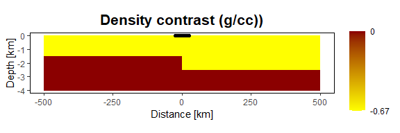
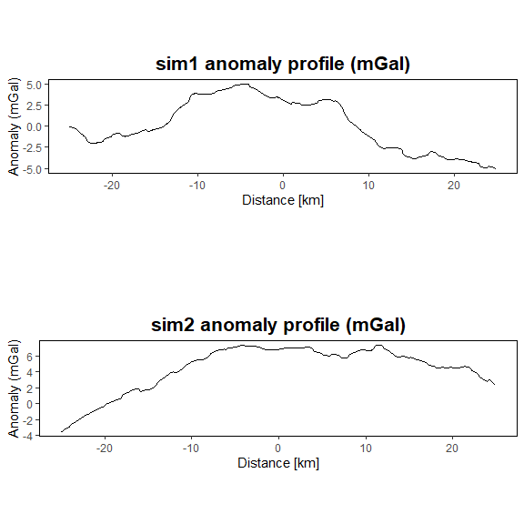
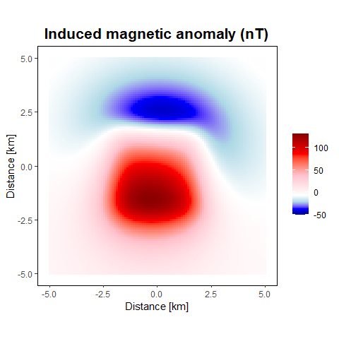

Demonstrating the gravmagsubs package
================
Collin Cronkite-Ratcliff, Geoffrey Phelps, Daniel Scheirer

# Prerequisites

In addition to the `gravmagsubs` package, this vignette uses the
packages `fields` (Nychka et al. 2021), `ggplot2` (Wickham 2016),
`gridExtra` (Auguie 2017), `scales` (Wickham and Seidel 2022), and
`scatterplot3d` (Ligges and Mächler 2003). Please make sure that
`fields`, `ggplot2`, `gridExtra`, `scales`, and `scatterplot3d` are
installed before following the vignette:

``` r
install.packages("fields")
install.packages("ggplot2")
install.packages("gridExtra")
install.packages("scales")
install.packages("scatterplot3d")
```

The `gravmagsubs` package must also be installed in order to follow the
vignette. For instructions on installing `gravmagsubs`, see the README.

# Introducing gravmagsubs

This vignette briefly outlines the main functionality of the
`gravmagsubs` package.

`gravmagsubs` is an R package for calculating the gravitational or
magnetic anomaly at a predefined set of locations produced by a
predefined set of rectangular prisms. The methods are:

-   `rectprismgrav()`, a method that calculates the gravitational
    anomaly (the vertical component of the gravitational acceleration)
    at a location or series of locations given a prism or series of
    prisms, their input dimensions, and their density contrasts.
-   `rectprismmag()`, a method that calculates the magnetic anomaly at a
    location or series of locations given a prism or series of prisms,
    their input dimensions, and their magnetization properties.

To import the `gravmagsubs` package into an R session:

``` r
library(gravmagsubs)
```

For help on how to use the package, use the following command to view
the documentation for the package:

``` r
?gravmagsubs
```

or

``` r
help(gravmagsubs)
```

# rectprismgrav()

The `rectprismgrav()` function calculates the gravity anomaly from a
series of 3-D rectangular prisms with vertical sides using the algorithm
of Plouff (1975a). To view the arguments for `rectprismgrav()`, type the
following:

``` r
args(rectprismgrav)
```

To see details about the function arguments, units, and output, access
the help page by typing:

``` r
help(rectprismgrav)
```

or

``` r
?rectprismgrav
```

We begin by showing simple examples of calculating the gravity anomaly
at a point, then along a line to generate 1-D anomalies from 2-D
profiles of simple geologic models, then for more complex density
models, before finally moving to 2-D anomalies of simple 3-D geologic
models.

## rectprismgrav() for single calculations from a simple model

To calculate the gravity anomaly of simple models, it is only necessary
to specify the measurement location (the “station”), the sides of the
rectangular prism, and the density contrast.

Note that:

1.  the edges of the prisms are always parallel to the standard
    Cartesian coordinate system,
2.  spatial units are assumed to be km,
3.  density units are assumed to be grams per cubic centimeter (g/cc),
    and
4.  returned values are in milligals (mGal).

For example, we can calculate the gravity anomaly at a single station
located at the origin.

``` r
# location of the point where the gravity anomaly will be calculated
gravstation <- data.frame(x=0, y=0, z=0)
```

We define a regular prism with dimensions of 10 km by 10 km in the
horizontal dimensions and 5 km in the vertical dimension, whose top is
at a depth of 5 km and is directly below the origin.

``` r
# the rectangular prism is defined by its six edges
prism1 <- data.frame(xmin=-5, xmax=5,
                     ymin=-5, ymax=5,
                     zmin=-10, zmax=-5)
```

We set the density contrast of the prism to be +0.3 g/cc,:

``` r
# density contrast in g/cc
drho <- 0.3
```

We then use the `rectprismgrav()` function to calculate the gravity
anomaly at the station:

``` r
gravanom <- rectprismgrav(gravstation$x, gravstation$y, gravstation$z,
                          prism1$xmin, prism1$xmax,
                          prism1$ymin, prism1$ymax,
                          prism1$zmin, prism1$zmax, drho)
```

We can check the value of the gravity anomaly, in mGal, at the single
station located at (0, 0, 0):

``` r
gravanom
```

    ##          [,1]
    ## [1,] 13.17689

To calculate the anomaly at another location, this time located away
from the origin, we redefine the coordinates of the station and run
`rectprismgrav()` again to obtain the new value.

``` r
gravstation <- data.frame(x=-2, y=2, z=0)

gravanom <- rectprismgrav(gravstation$x, gravstation$y, gravstation$z,
                          prism1$xmin, prism1$xmax,
                          prism1$ymin, prism1$ymax,
                          prism1$zmin, prism1$zmax, drho)
```

Since we are calculating the gravity anomaly further away from the
center of mass of the prism, the gravity anomaly will be slightly weaker
than before:

``` r
gravanom
```

    ##          [,1]
    ## [1,] 11.90794

## rectprismgrav() for simple cross-sectional models

Now consider the schematic of a vertical fault offset in a 2-D
cross-section, centered at the origin, extending from -500 to +500 km in
width and down to a depth of 4 km, with a fault offset of 1 km, an
offset midpoint of 2 km depth, and a shallow-side depth of 1.5 km. The
density contrast between the lower and upper unit is -0.67 g/cc. The
formula for the gravity anomaly produced by a half slab in this
situation (Lowrie 1997) is:

$$
(1) \qquad\qquad\qquad\qquad g = 2\rho\gamma h_1 \biggl(\frac{\pi}{2} + \tan^{-1}\biggl(\frac{x}{z_0}\biggr)\biggr)
$$

where $g$ is the gravitational anomaly in (mGal), $\rho$ is the density
contrast (g/cc), $h_1$ is the thickness of the half slab (km), $z_0$ is
the depth to the midpoint of the half-slab (km), $x$ is the location
along the x-axis in kilometers, and $\gamma$ is the gravitational
constant ($\times$ 1.e-11 m$^3$ kg$^{-1}$ s$^{-2}$) scaled to match the
units of the other inputs.

The formula for the gravity anomaly produced by an infinite slab (Lowrie
1997) is:

$$
(2) \qquad\qquad\qquad\qquad g = 2\pi\rho\gamma h_2 \qquad\qquad\qquad\qquad
$$

where $h_2$ is the slab thickness (km).

Equation 2 can be added to Equation 1 to calculate the gravitational
anomaly of the full cross-section:

$$
(3) \qquad\qquad\qquad\qquad g = 2\pi\rho\gamma h_2 + 2\rho\gamma h_1 \biggl(\frac{\pi}{2} + \tan^{-1}\biggl(\frac{x}{z_0}\biggr)\biggr)
$$

To calculate the gravity anomaly using Equation 3, define a data frame
for the gravity station x-axis locations at which to measure the gravity
anomaly:

``` r
grav.calc <- data.frame(X = seq(-25, by=.1, length=500)) 
```

The x-location of the gravity stations is given by `grav.calc$X`, and
the y- and z-locations are both zero. Create the Y and Z coordinates of
the gravity stations:

``` r
grav.calc$Y <- 0
grav.calc$Z <- 0
```

Now calculate the anomaly according to Equation 3, where the half-slab
thickness is the fault offset of 1 km, the midpoint to the half-slab is
2 km, the thickness of the infinite slab is 1.5 km, and the density
contrast is -0.67 g/cc.

``` r
rho <- -0.67    # density contrast (g/cc)
gamma <- 6.674  # gravitational constant (x 1.e-11 m^3 / (kg s^2))
h1 <- 1.5       # infinite slab thickness (km)
h2 <- 1         # fault offset (km)
grav.calc$Geq <- 2*pi*rho*gamma*h1 + 2*rho*gamma*h2*(pi/2 + atan(grav.calc$X/2))
```

For the equivalent calculation using `rectprismgrav()`, create the
identical cross-section, with prism center spacing at 1 km in the
horizontal dimension and 100 m in the vertical dimension.

``` r
prism.width.h <- 1       # horizontal prism width (km)
prism.width.v <- 0.1     # vertical prism thickness (km)
X1 <- seq(-499.5, 499.5, by=prism.width.h)
Z1 <- seq(-3.95, -0.05, by=prism.width.v)
XZr <- expand.grid(xcenter=X1, Y=0, zcenter=Z1)
```

Now define the density contrast as -0.67 g/cc above the offset slab and
0 below it. To plot the section with the density contrast, we use the
`ggplot2` package (Wickham 2016) and the `scales` package (Wickham and
Seidel 2022).

``` r
XZr$density <- 0
XZr$density[XZr$zcenter > -h1] <- rho
XZr$density[XZr$zcenter > -(h1 + h2) & XZr$xcenter > 0] <- rho

library(ggplot2)
library(scales)

# plot with custom color scale 
ggplot() +
  geom_raster(data = XZr, aes(x = xcenter, y = zcenter, fill = density)) +
  scale_fill_gradientn(colours=c("yellow", "darkred"),
                       values = rescale(c(-0.67, -0.33, 0)),
                       breaks = c(-0.67, 0),
                       labels = paste(c(-0.67, 0)),
                       limits = c(-0.67, 0),
                       name = "") +
  geom_point(data = grav.calc, aes(x=X, y=Z)) +
  labs(x = "Distance [km]",
       y = "Depth [km]",
       title = "Density contrast (g/cc))") +
  theme(panel.background = element_rect(colour = "black", fill = "white"),
        panel.grid = element_blank(),
        plot.title = element_text(face = "bold", hjust = 0.5, size=16),
        aspect.ratio = 1/5)
```



This shows the density contrast of the resulting cross-section. The
locations of the gravity stations are shown as black dots positioned
above the fault offset.

Calculate the gravity anomaly using `rectprismgrav()`. Extend the prisms
+/- 500 km in the Y direction (perpendicular to the X-Z plane), to
approximate a perfect 2-D model.

``` r
grav.calc$Ggms <- as.vector(rectprismgrav(grav.calc$X, grav.calc$Y, grav.calc$Z,
                                          XZr$xcenter - prism.width.h/2,
                                          XZr$xcenter + prism.width.h/2,
                                          XZr$Y - 500, XZr$Y + 500,
                                          XZr$zcenter - prism.width.v/2,
                                          XZr$zcenter + prism.width.v/2, XZr$density) )
```

Compare the statistics of the two anomalies:

``` r
summary(grav.calc$Ggms)
```

    ##    Min. 1st Qu.  Median    Mean 3rd Qu.    Max. 
    ##  -69.41  -68.70  -55.86  -56.06  -43.45  -42.75

``` r
summary(grav.calc$Geq)
```

    ##    Min. 1st Qu.  Median    Mean 3rd Qu.    Max. 
    ##  -69.52  -68.81  -55.97  -56.16  -43.56  -42.86

And the mean and standard deviation of their difference:

``` r
sd(grav.calc$Geq - grav.calc$Ggms)
```

    ## [1] 0.0166237

``` r
mean(grav.calc$Geq - grav.calc$Ggms)
```

    ## [1] -0.1075556

We see that `rectprismgrav()` agrees quite well with the output of the
theoretical equations for the idealized cross-section shown.

``` r
ggplot() +
  geom_line(data = grav.calc, aes(x = X, y = Geq,
                                  colour = "Calculated from equation")) +
  geom_line(data = grav.calc, aes(x = X, y = Ggms,
                                  colour = "Calculated from rectprismgrav()")) +
  scale_colour_manual("", values=c("blue", "darkgreen")) +
  labs(title = "", x = "Distance [km]", y = "Gravity anomaly (mGal)") +
  theme(panel.background=element_rect(colour="black", fill="white"),
        legend.key = element_rect(fill = "white"),
        legend.position = c(0.2, 0.3),
        panel.grid = element_blank(),
        plot.title = element_text(face = "bold",hjust = 0.5, size=16 ),
        aspect.ratio = 1/4)
```

 Note that although the model
extends to 500 km in either direction, the gravity stations are located
within 25 km of the center of the model.

## rectprismgrav() for multiple complex cross-sectional models

### Using the sensitivity matrix to speed up calculations

An important feature of `rectprismgrav()` is the ability to calculate
and save the sensitivity matrix. The calculation of the gravity anomaly
can be factored into two matrices, the first of which, called the
sensitivity matrix, represents the effect of the shape, orientation, and
distance of the prisms from the measurement point (the gravity station).
The second matrix represents the effect of the density contrast.

$$
(4) \qquad\qquad\qquad\qquad \bf{g} = \bf{G}\bf{\rho}
$$

where $\bf{g}$ is the gravity anomaly, $\bf{\rho}$ contains the density
contrast of the individual prisms, and $\bf{G}$ is the sensitivity
matrix. $\bf{G}$ has dimensions of *M* $\times$ *N*, where *M* is the
number of gravity stations, and *N* is the number of prisms in the
model. Matrix element *i,j*, called the sensitivity, represents the
effect on the *i*-th gravity station by the *j*-th prism (Li and
Oldenburg 1998). In this case, sensitivity has dimensions of
acceleration per unit density. The vector $\bf{\rho}$ contains the
density contrast of the *j*-th prism.

The calculation time is largely due to the time it takes to calculate
the sensitivity matrix. By calculating the sensitivity matrix once, and
saving the result, different density contrasts for the same prisms and
stations can be explored rapidly, because only the matrix product needs
to be calculated.

The `rectprismgrav()` function has a flag, `bycell`, which is `FALSE` by
default. To obtain the sensitivity matrix, set `bycell=TRUE` and the
density contrast to 1.

The ordering of the sensitivity matrix elements matches that of the
inputs; the first row corresponds to the first gravity station, while
the first column corresponds to the first prism, the second column to
the second prism, etc.

Using the previous example, add a second column of density values to
`XZr`.

``` r
XZr$density1 <- 1
```

Now calculate the sensitivity matrix, using the new density values and
the `bycell=TRUE` option.

``` r
XZr.sensmat <- rectprismgrav(grav.calc$X, grav.calc$Y, grav.calc$Z,
                             XZr$xcenter - prism.width.h/2,
                             XZr$xcenter + prism.width.h/2,
                             XZr$Y - 500, XZr$Y + 500,
                             XZr$zcenter - prism.width.v/2,
                             XZr$zcenter + prism.width.v/2, XZr$density1,
                             bycell=TRUE)

dim(XZr.sensmat)
```

    ## [1]   500 40000

To visualize the sensitivity matrix for the tenth gravity station, for
example, we can plot the cross-section and use the sensitivity values to
color the prisms. (Because the values are highly skewed, we assign the
color scale according to the log of the sensitivity, so that the highest
values are in red).

``` r
# create a data frame with locations and log of the 10th gravity station
xzs1 <- data.frame(x=XZr[,1], z=XZr[,3], sensiv=log10(XZr.sensmat[10,]))

# create the plot
ggplot() +
  geom_raster(data = as.data.frame(xzs1) , aes(x = x, y = z, fill = sensiv)) +
  scale_fill_gradientn(colours=c("yellow","orange","red", "darkred"),
                       name="") +
  geom_point(data = grav.calc, aes(x=X, y=Z), colour="darkgray") +
  geom_point(data = grav.calc[10,], aes(x=X, y=Z), colour="black") +
  labs(x = "Distance [km]", 
       y = "Depth [km]",
       title = "log(Sensitivity(mGal per g/cc))") +
  theme(panel.background=element_rect(colour="black", fill="white"),
        panel.grid = element_blank(),
        plot.title = element_text(face = "bold",hjust = 0.5, size=16 ),
        aspect.ratio=1/4)
```


The locations of the gravity stations are shown as gray dots positioned
above the center of the model, with the location of the tenth station
shown in black.

The effect of the prisms is related to their position relative to the
gravity station, with prisms directly below the station contributing the
most to the z-component of the gravitational acceleration.

Now that the sensitivity matrix is stored, experimenting with multiple
densities is a matrix multiplication operation. For example, suppose the
average slab density in the previous model is uncertain, and may range
from a low value of -0.9 g/cc to a high value of -0.4 g/cc. We can add
these end-member values to the data frame.

``` r
XZr$density2 <- 0
```

We create new columns in the data frame to represent these alternate
density values. Then we assign slab values to -0.9 g/cc and -0.4 g/cc in
the new columns to represent these new models:

``` r
XZr$density2[XZr$density == rho] <- -0.9
XZr$density3 <- 0
XZr$density3[XZr$density == rho] <- -0.4
```

There are now three models of average slab densities for the
cross-section: -0.67 g/cc, -0.9 g/cc, and -0.4 g/cc, located in the
three density columns of the `XZr` data frame. Multiplying these models
by the sensitivity matrix will yield and *M* $\times$ *P* matrix of *M*
gravity stations and *P* models (note the data frame must be converted
to a matrix before performing the calculations).

``` r
gravanom.models <- XZr.sensmat %*% as.matrix(XZr[,c("density", "density2", "density3")])
```

Plot the results.

``` r
grav.calc$gmod.orig <- gravanom.models[,1]
grav.calc$gmod.low <- gravanom.models[,2]
grav.calc$gmod.high <- gravanom.models[,3]

ggplot() +
  geom_line(data = grav.calc, linewidth=2,
            aes(x = X, y = gmod.low, colour = "-0.9 g/cc")) +
  geom_line(data = grav.calc, linewidth=2,
            aes(x = X, y = gmod.orig, colour = "-0.67 g/cc")) +
  geom_line(data = grav.calc, linewidth=2,
            aes(x = X, y = gmod.high, colour = "-0.4 g/cc")) +
  scale_colour_manual(name="Density contrast", values=c("blue", "black", "red")) +
  labs(title = "", x = "Distance [km]", y = "Gravity anomaly (mGal)") +
  theme(panel.background=element_rect(colour="black", fill="white"),
        legend.key = element_rect(fill = "white"),
        legend.position = "right",
        panel.grid = element_blank(),
        plot.title = element_text(face = "bold", hjust = 0.5, size=16 ),
        aspect.ratio = 1/4)
```


### Generating multiple gravity anomalies for complex cross-sectional models

It may be of interest to calculate the gravity anomaly of more complex
geologic models. Suppose, for example, a sedimentary basin is filled
with a mix of variably dense lenses of alluvial fan deposits. There is
not enough information to map these deposits in the subsurface, but
their distribution could be simulated with a Gaussian random field. The
package `fields` (Nychka et al. 2021) can be used to generate these
models.

``` r
library(fields)
set.seed(123)
```

For this example the Gaussian random field is defined as having a
correlation length of 300 m in the vertical direction and 15 km in the
horizontal direction. The realizations will have Gaussian distributions
for density that are very similar to each other, but they will differ in
the spatial distribution of the values. Similar values will tend to
cluster according to the parameters of the Gaussian random field model.
In this case, the clusters will tend towards dimensions of 15 km
horizontal by 300 m vertical.

Specify the parameters of the random field model.

``` r
# setting the anisotropy matrix
aniso.mat <- matrix(c(15/prism.width.h, 0, 0, 0.3/prism.width.v), nrow=2, byrow=TRUE)
# need to re-format the simulation grid using indices
rf.grid <- list(x = 1:length(X1), y = 1:length(Z1))
# setting up the random field model
rf.model <- stationary.image.cov(setup=TRUE, grid = rf.grid, V=aniso.mat )
```

Generate two realizations of subsurface density using this random field
model, for the same set of prisms used in the previous section. By
default, the random field will have a mean of zero and a standard
deviation of approximately 1 g/cc. We can re-scale the results to
achieve a desired standard deviation of density, in this case a more
realistic standard deviation of 0.14 g/cc (variance of 0.02 g/cc).

``` r
std.dev <- 0.14
grav.sim.1 <- sim.rf(rf.model) * std.dev
grav.sim.2 <- sim.rf(rf.model) * std.dev
```

The mean density of each realization is approximately zero, and the
standard deviation is approximately 0.14 g/cc.

Plot the results:

``` r
library(gridExtra)
    
# Create the plot with the title: sim1 density contrast (g/cc)

xzg <- data.frame(x=XZr[,1], z=XZr[,3],
                  gravsim1=c(grav.sim.1),
                  gravsim2=c(grav.sim.2))

g1.plot<- ggplot() +
  geom_raster(data = as.data.frame(xzg), aes(x = x, y = z, fill = gravsim1)) +
  scale_fill_gradientn(colours=c("yellow", "orange", "red", "darkred"),
                       breaks = c(-0.5, 0, 0.5),
                       labels = paste(c(-0.5, 0 ,0.5)),
                       name = "") +
  geom_point(data = grav.calc, aes(x=X, y=Z)) +
  labs(x = "Distance [km]",
       y = "Depth [km]",
       title = "sim1 density contrast (g/cc)") +
  theme(panel.background=element_rect(colour="black", fill="white"),
        panel.grid = element_blank(),
        plot.title = element_text(face = "bold", hjust = 0.5, size=16 ),
        legend.position = "bottom",
        aspect.ratio = 1/5)
        
# Create the plot with the title: sim2 density contrast (g/cc)

g2.plot<- ggplot() +
  geom_raster(data = as.data.frame(xzg), aes(x = x, y = z, fill = gravsim2)) +
  scale_fill_gradientn(colours=c("yellow", "orange", "red", "darkred"),
                       breaks = c(-0.5, 0, 0.5),
                       labels = paste(c(-0.5, 0, 0.5)),
                       name = "") +
  geom_point(data = grav.calc, aes(x=X, y=Z)) +
  labs(x = "Distance [km]",
       y = "Depth [km]",
       title = "sim2 density contrast (g/cc)") +
  theme(panel.background = element_rect(colour="black", fill="white"),
        panel.grid = element_blank(),
        plot.title = element_text(face = "bold", hjust = 0.5, size=16 ),
        legend.position = "bottom",
        aspect.ratio = 1/5)
        
grid.arrange(g1.plot, g2.plot, nrow=2)
```


The locations of the gravity stations are shown as black dots positioned
above the center of the model.

Taking advantage of the sensitivity matrix, the gravity anomalies for
the two realizations can now be calculated by matrix multiplication.
First, however, we can stack the two realizations into a single matrix
so that the gravity anomaly can be computed once on all realizations.

``` r
grav.sims.mat <- matrix(c(grav.sim.1, grav.sim.2) , byrow=FALSE, ncol =2)
grav.sims.anom <- XZr.sensmat %*% grav.sims.mat
dim(grav.sims.anom)
```

    ## [1] 500   2

The dimensions of the output represent 500 gravity stations and 2
resulting gravity anomaly profiles.

Now we plot the anomalies from the two realizations. From the plots, it
can be seen that a 4 km thickness of sediments, with the density
distributions specified, produce gravity anomalies that exhibit
quasi-periodic behavior, with an amplitude of up to approximately 10
mGal. The quasi-periodic behavior is the result of the spatial
aggregation of like density values within the sediments.

``` r
anom.df <- data.frame(x = grav.calc$X,
                      anom1 = grav.sims.anom[,1],
                      anom2 = grav.sims.anom[,2])

g1.plot<- ggplot() +
  geom_line(data = as.data.frame(anom.df), aes(x = x, y = anom1)) +
  labs(x = "Distance [km]",
       y = "Anomaly (mGal)",
       title = "sim1 anomaly profile (mGal)") +
  theme(panel.background = element_rect(colour="black", fill="white"),
        panel.grid = element_blank(),
        plot.title = element_text(face = "bold", hjust = 0.5, size=16 ),
        legend.position = "bottom",
        aspect.ratio = 1/5)

g2.plot<- ggplot() +
  geom_line(data = as.data.frame(anom.df), aes(x = x, y = anom2)) +
  labs(x = "Distance [km]",
       y = "Anomaly (mGal)",
       title = "sim2 anomaly profile (mGal)") +
  theme(panel.background = element_rect(colour="black", fill="white"),
        panel.grid = element_blank(),
        plot.title = element_text(face = "bold", hjust = 0.5, size=16 ),
        legend.position = "bottom",
        aspect.ratio = 1/5)

grid.arrange(g1.plot, g2.plot, nrow=2)
```



## rectprismgrav() for 3-D models

The generation of 2-D gravitational anomalies from 3-D source bodies
parallels that of the generation of 1-D anomalies from 2-D source
bodies. First, generate a 2-D grid of gravity stations, with elevation
of zero.

``` r
xstations <- seq(-5, 5, by=0.1)
ystations <- seq(-5, 5, by=0.1)
D3.stations <- expand.grid(xstations, ystations)
D3.stations$Zstation <- 0
names(D3.stations) <- c("Xstation", "Ystation", "Zstation")
```

Then create the source body, in this case a 3-D rectangular body 4 km in
the X and Y dimensions and 2 km in the Z dimension, centered at the
origin and with a top located 1 km below the surface, with the density
contrast ranging from -0.2 g/cc to 0.2 g/cc and increasing along the
y-axis. The prisms each measure 0.1 km on a side. Plot the prism centers
using `scatterplot3d()`, from the `scatterplot3d` package (Ligges and
Mächler 2003).

``` r
width <- 0.1
half.width <- width / 2

xsource <- seq(-2 + half.width, 2 - half.width, by=width)
ysource <- seq(-2 + half.width, 2 - half.width, by=width)
zsource <- seq(-3 + half.width, -1 - half.width, by=width)

D3.source <- expand.grid(xsource, ysource, zsource)
names(D3.source) <- c("xcenter", "ycenter", "zcenter")

D3.source$density <- 0.1 * D3.source$ycenter

# define the color ramp by splitting the density model into 10 equally-spaced intervals
yorPal <- colorRampPalette(c('khaki', 'orange', 'firebrick'))
D3.cols = cut(D3.source$density, breaks=10)

img3d <- scatterplot3d::scatterplot3d(D3.source$xcenter,
                                      D3.source$ycenter,
                                      D3.source$zcenter,
                                      pch=16, cex.symbols=.5,
                                      color=yorPal(10)[as.numeric(D3.cols)],
                                      xlab="Distance [km]", ylab="[km]", zlab="[km]")

leg.minmax <- c(paste("+", max(D3.source$density), " g/cc", sep=""),
                " 0.0 g/cc",
                paste(min(D3.source$density), "g/cc"))
legend(img3d$xyz.convert(3.7, -2, -2.7), legend = leg.minmax,
       col=c("firebrick", "orange", "khaki"), pch=16, title="Density contrast",
       inset = -0.25, xpd = TRUE, bty="n")
```


Calculate the gravity anomaly associated with the prism and plot it.
Note that we defined the prisms based on their center coordinates, but
we need to provide the coordinates of the cell edges (`xmin`, `xmax`,
`ymin`, `ymax`, `zmin`, `zmax`). We find the edges by adding or
subtracting half of the prism width to the prism centers.

``` r
D3.gravanom <- rectprismgrav(D3.stations$Xstation,
                             D3.stations$Ystation,
                             D3.stations$Zstation,
                             D3.source$xcenter - half.width,
                             D3.source$xcenter + half.width,
                             D3.source$ycenter - half.width,
                             D3.source$ycenter + half.width,
                             D3.source$zcenter - half.width,
                             D3.source$zcenter + half.width,
                             D3.source$density,
                             bycell=FALSE)

# create data frame
d3.st <- data.frame(x=D3.stations$Xstation, y=D3.stations$Ystation,
                    val1 = D3.gravanom)

# plot with custom color scale 
ggplot() +
  geom_raster(data = d3.st, aes(x = x, y = y, fill = val1)) +
  scale_fill_gradientn(
    colours = c("darkblue", "blue", "skyblue", "white", "tomato", "red", "darkred"),
    values = rescale(c(-1.5, 0, 1.5)),
    breaks = seq(-1.5, 1.5, 0.5),
    labels = paste(seq(-1.5, 1.5, 0.5)),
    limits = c(-1.6, 1.6),
    name = "") +
  labs(x = "Easting [km]", 
       y = "Northing [km]",
       title = "Gravity anomaly (mGal)") +
  theme(panel.background = element_rect(colour = "black", fill = "white"),
        panel.grid = element_blank(),
        plot.title = element_text(face = "bold", hjust = 0.5, size=16),
        aspect.ratio = 1)
```


# rectprismmag()

The `rectprismmag()` function calculates the magnetic field anomaly from
a series of 3-D rectangular prisms with vertical sides using the
algorithm of Plouff (1975b).

Calculating the magnetic field anomaly follows the same approach as that
for gravity, except that additional parameters need to be specified for
the magnetization properties instead of the density contrast. To view
the arguments for `rectprismmag()`, type the following:

``` r
args(rectprismmag)
```

To see details about the function arguments, units, and output, access
the help page by typing:

``` r
help(rectprismmag)
```

or

``` r
?rectprismmag
```

## rectprismmag() for a single induced source body

To calculate the magnetic anomaly, in addition to the station locations
and source body edges, the remanent magnetization at each prism needs to
be specified along with the properties of the inducing field.

We use the same dimensions as the 3-D gravity model from the previous
section, in this case assuming that the model has a normally
distributed, spatially uncorrelated, magnetic susceptibility with an
average of 0.015 SI units, and a standard deviation of 0.001 SI units.
The ambient field is given a constant intensity of 48,800 nT, with
inclination of 60 degrees (measured from horizontal downwards) and
declination of 12 degrees (positive clockwise from true north).

Add the susceptibility values to the data frame defining the prisms.

``` r
D3.source$suscnorm <- rnorm(n=length(D3.source[,1]), mean=0.015, sd=0.001)
```

Run `rectprismmag()` and plot the results. Note that all values for the
magnetic field (`suscvolsi`, `nrmstr`, `nrmdecl`, `nrmincl`,
`fieldtotal`, `fielddecl`, `fieldincl`) are vectors which must have one
entry per prism. Here, because the values are constant, we supply them
directly to the data frame.

``` r
D3.source$nrmstr <- 0
D3.source$nrmdecl <- 0
D3.source$nrmincl <- 0
D3.source$fieldtotal <- 48800
D3.source$fielddecl <- 12
D3.source$fieldincl <- 60

D3.maganomind <- rectprismmag(D3.stations$Xstation,
                              D3.stations$Ystation,
                              D3.stations$Zstation,
                              D3.source$xcenter - half.width,
                              D3.source$xcenter + half.width,
                              D3.source$ycenter - half.width,
                              D3.source$ycenter + half.width,
                              D3.source$zcenter - half.width,
                              D3.source$zcenter + half.width,
                              suscvolsi = D3.source$suscnorm,
                              nrmstr = D3.source$nrmstr,
                              nrmdecl = D3.source$nrmdecl,
                              nrmincl = D3.source$nrmincl,
                              fieldtotal = D3.source$fieldtotal,
                              fielddecl = D3.source$fielddecl,
                              fieldincl = D3.source$fieldincl,
                              bycell=FALSE)

# create data frame
d3.st <- D3.stations
d3.st$val <- D3.maganomind

# plot with custom color scale
ggplot() +
  geom_raster(data = as.data.frame(d3.st),
              aes(x = Xstation, y = Ystation, fill = val)) +
  scale_fill_gradientn(
    colours = c("darkblue", "blue", "lightblue", "white", "pink", "red", "darkred"),
    values = rescale(c(min(d3.st$val), 0, max(d3.st$val))),
    breaks = c(-50, 0, 50, 100),
    labels = paste(c("-50", 0, "50", "100")),
    limits = c(-50, max(d3.st$val)),
    name = "") +
  labs(x = "Distance [km]", 
       y = "Distance [km]",
       title = "Induced magnetic anomaly (nT)") +
  theme(panel.background = element_rect(colour="black", fill="white"),
        panel.grid = element_blank(),
        plot.title = element_text(face = "bold", hjust = 0.5, size=16),
        aspect.ratio = 1)
```



## rectprismmag() for a single remanently magnetized source body with an induced component

Next we reproduce the example shown in Fig. 1 of Gonzalez, Barbosa, and
Oliveira (2022), which consists of a prism with both induced and
remanent magnetization. The prism measures 2 km in the X dimension, 2.5
km in the Y dimension, and 1.95 km in the Z dimension, with the top of
the prism located 0.55 km below the surface. The ambient field has an
intensity of 23,639 nT, an inclination of -45 degrees, and a declination
of -30 degrees. The prism has a magnetic susceptibility of 0.1 (SI
units). The prism also has a remanent magnetization of 5 A/m, and the
remanent magnetic field has an inclination of -30 degrees and a
declination of -15 degrees. We do not add Gaussian noise to our example
as done by Gonzalez, Barbosa, and Oliveira (2022).

``` r
xstations <- seq(-5, 10, by=0.25)
ystations <- seq(-6, 10, by=0.25)
stations <- expand.grid(xstations, ystations)
stations$Zstation <- 0
names(stations) <- c("Xstation", "Ystation", "Zstation")

maganomnrm <- rectprismmag(stations$Xstation,
                           stations$Ystation,
                           stations$Zstation,
                           xmin = 1,
                           xmax = 3,
                           ymin = 1,
                           ymax = 3.5,
                           zdeep = -2.5,
                           zshallow = -0.55,
                           suscvolsi = 0.1,
                           nrmstr = 5,
                           nrmdecl = -15,
                           nrmincl = -30,
                           fieldtotal = 23639,
                           fielddecl = -30,
                           fieldincl = -45,
                           bycell=FALSE)

# create data frame
d3.st <- data.frame(x=stations[,1], y=stations[,2], val1 = maganomnrm)

# plot with custom color scale 
ggplot() +
  geom_raster(data = d3.st, aes(x = x, y = y, fill = val1)) +
  scale_fill_gradientn(
    colours = c("darkblue", "blue", "skyblue", "white", "tomato", "red", "darkred"),
    values = rescale(c(-1000, 0,1500)),
    breaks = c(-1000, -500, 0, 500, 1000, 1500),
    labels = paste(c(-1000, -500, 0, 500, 1000, 1500)),
    limits = c(-1000, 1500),
    name = "") +
  labs(x = "Easting [km]", 
       y = "Northing [km]",
       title = "Total magnetic anomaly (nT)") +
  theme(panel.background = element_rect(colour = "black", fill = "white"),
        panel.grid = element_blank(),
        plot.title = element_text(face = "bold", hjust = 0.5, size=16),
        aspect.ratio = 1)
```


# Summary

The purpose of this vignette has been to show how to apply the
`gravmagsubs` functions to calculate gravitational and magnetic
anomalies. Methods of calculating anomalies at discrete points, and
across arrays of regularly spaced points, have been demonstrated.

In general the calculation time is rapid (a few seconds) for models with
tens of thousands of rectangular prisms and tens of thousands of station
locations, when calculated on a scientific laptop (64-bit Intel I9
processor (2.40 GHz) with 64 GB RAM). For gravity, calculation time can
be improved by taking advantage of the sensitivity matrix, which allows
for rapid calculations of multiple density models given the same set of
prisms.

# References

<div id="refs" class="references csl-bib-body hanging-indent">

<div id="ref-Auguie2017" class="csl-entry">

Auguie, B. 2017. *<span class="nocase">gridExtra</span>: Miscellaneous
Functions for "Grid" Graphics*.
<https://CRAN.R-project.org/package=gridExtra>.

</div>

<div id="ref-GonzalezEtal2022" class="csl-entry">

Gonzalez, S. P., V. C. F. Barbosa, and V. C. Oliveira. 2022. “Analyzing
the Ambiguity of the Remanent-Magnetization Direction Separated into
Induced and Remanent Magnetic Sources.” *Journal of Geophysical
Research: Solid Earth* 127 (e2022JB024151).
<https://doi.org/doi:10.1029/2022JB024151>.

</div>

<div id="ref-LiOldenburg1998" class="csl-entry">

Li, Y., and D. Oldenburg. 1998. “3-D Inversion of Gravity Data.”
*Geophysics* 63: 109–19. <https://doi.org/10.1190/1.1444302>.

</div>

<div id="ref-LiggesMachler2003" class="csl-entry">

Ligges, U., and M. Mächler. 2003. “<span
class="nocase">scatterplot3d</span> - an R Package for Visualizing
Multivariate Data.” *Journal of Statistical Software* 8 (11): 1–20.
<https://doi.org/10.18637/jss.v008.i11>.

</div>

<div id="ref-Lowrie1997" class="csl-entry">

Lowrie, W. 1997. *Fundamentals of Geophysics*. Cambridge University
Press.

</div>

<div id="ref-NychkaEtal2021" class="csl-entry">

Nychka, D., R. Furrer, J. Paige, and S. Sain. 2021. “<span
class="nocase">fields</span>: Tools for Spatial Data.” Boulder, CO, USA:
University Corporation for Atmospheric Research.
<https://github.com/dnychka/fieldsRPackage>.

</div>

<div id="ref-Plouff1975a" class="csl-entry">

Plouff, D. 1975a. “Derivation of Formulas and FORTRAN Programs to
Compute Gravity Anomalies of Prisms.” No. PB-243-526. National Technical
Information Service.
<https://ntrl.ntis.gov/NTRL/dashboard/searchResults/titleDetail/PB243526.xhtml>.

</div>

<div id="ref-Plouff1975b" class="csl-entry">

———. 1975b. “Derivation of Formulas and FORTRAN Programs to Compute
Magnetic Anomalies of Prisms.” No. PB-243-525. National Technical
Information Service.
<https://ntrl.ntis.gov/NTRL/dashboard/searchResults/titleDetail/PB243525.xhtml>.

</div>

<div id="ref-Wickham2016" class="csl-entry">

Wickham, H. 2016. *<span class="nocase">ggplot2</span>: Elegant Graphics
for Data Analysis*. Springer-Verlag New York.
<https://ggplot2.tidyverse.org>.

</div>

<div id="ref-WickhamSeidel2022" class="csl-entry">

Wickham, H., and D. Seidel. 2022. *<span class="nocase">scales</span>:
Scale Functions for Visualization*. <https://scales.r-lib.org>.

</div>

</div>
